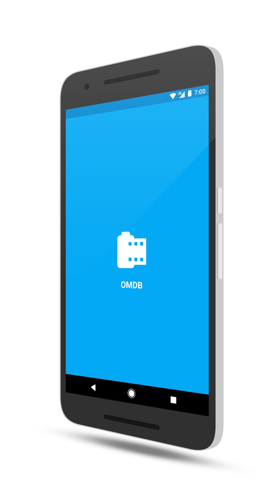

# OMDB (A movie finder)

A simple android app that uses [OMDB api](http://www.omdbapi.com/) to search movies, series and episodes

**[Download APK](https://goo.gl/vF4NY6)**

*May the force be with you! ;-)*

 
 
 
 
 

